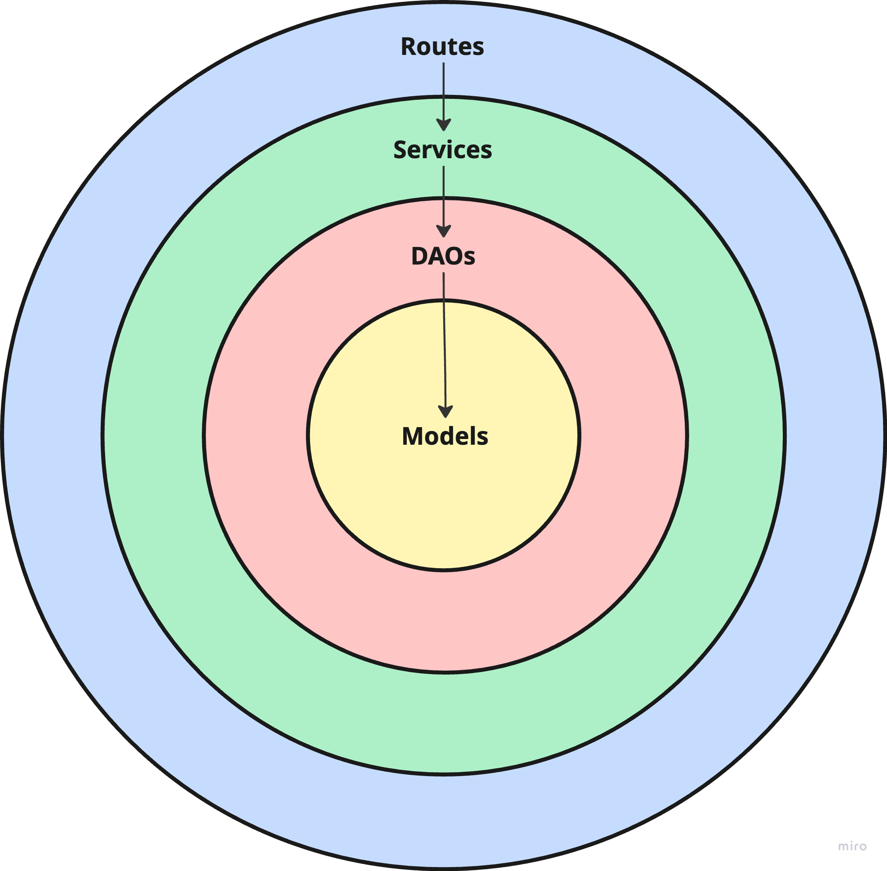
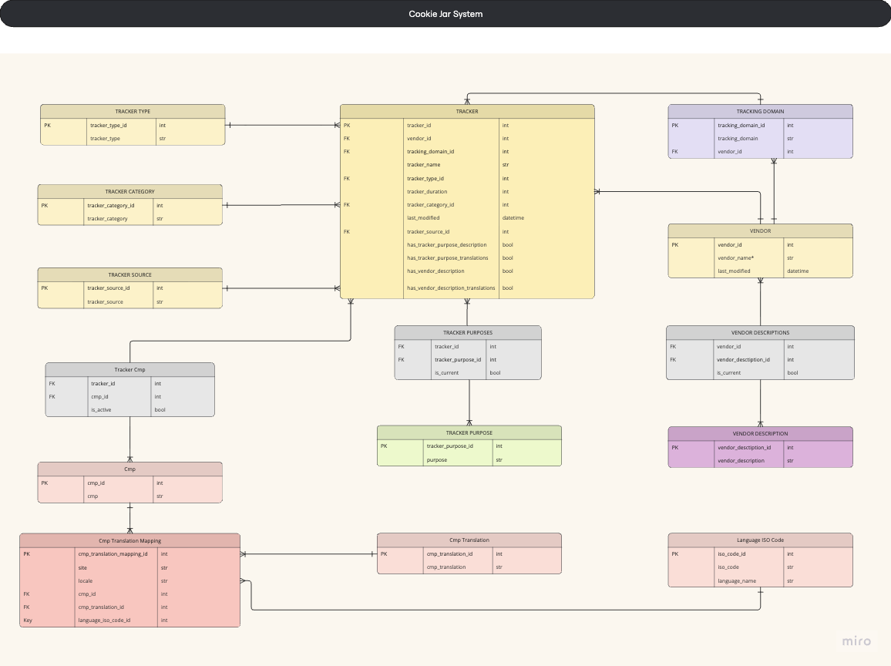

# Cookie Jar Masters

Cookie Jar Masters is a file-ingestion benchmark project built around a real digital-marketing use case.  
It tests how a tracker-processing service behaves under controlled burst load as workload shape and file size change.

## Project Context

This project is inspired by a GDPR transparency workflow. In practice, CMP scan files contain trackers detected on websites, and those trackers must be enriched with metadata so website users can review what data is collected.

In the original business process, monthly tracker scans are delivered per domain: 80 domains produce 80 scan files (CSV) each month. The ingestion service cross-references scan records against preseeded tracker data:
- if a tracker already exists, existing metadata is reused
- if a tracker is new, it is inserted and metadata can later be manually completed in a UI workflow.

This class project narrows scope to one technical slice: **ingesting and cross-referencing tracker scan files for performance and scalability benchmarking**.

All client-identifying names in files were anonymized. Any original client token is replaced by `CLIENT_X`.

## What the Service Does

The main endpoint is:

```http
POST /scan/ingest
```

Each request processes one scan file. Processing happens at row level:
- valid rows continue through reference resolution and existing/new tracker handling,
- invalid rows are rejected and written to failed output.

File lifecycle is simple:
- file starts in `input/`,
- processed rows are written to `processed/`,
- failed rows are written to `failed/`,
- input file is removed after processing.

Because validation is row-based, the same source file can produce two outputs:
- successful rows are written under that file name in processed/,
- failed rows are written under that file name in failed/.

## Tech Stack and Architecture
- Backend: Flask
- Database: PostgreSQL
- ORM: SQLAlchemy
- Schema migrations: Alembic (Flask-Migrate)
- App server: Gunicorn

### Code Organization (Onion Style Architecture)
- `models/`: table schema and relationships
- `daos/`: database operations (queries, inserts, updates, associations)
- `services/`: business flow and orchestration
- `routes/`: HTTP API layer and request validation


### Database Schema


### Ingestion Flow 
`TrackerIngestionOrchestrator` runs these services sequentially for each file:
- `IngestionService`: reads the file, normalizes columns/values, and splits valid vs invalid rows via `ValidationService`
- `ReferenceDataService`: ensures required reference entities exist and builds in-memory lookup maps (value -> id) for foreign-key resolution
- `TrackerUpsertService`:  resolves tracker identity keys, reuses existing trackers, inserts missing trackers, and ensures tracker-to-CMP links
- `PurposeService`: creates tracker-purpose links for rows that include purpose values (no-op for benchmark inputs) 
- `ReportingService`: builds per-file processed/failed output frames and base count metrics
- `ScanLifecycleService`: persists those outputs to storage under the source file name and moves the consumed input file

## Scripts
Executed once during initial dataset preparation, using the original TrustArc scans (`T1`) as the baseline. The resulting benchmark datasets were then reused across all experiments to keep inputs consistent and results comparable.
- `scripts/anonymize_client_files.py`  
  Used to replace client-identifying names in file content and file names with `CLIENT_X`. 

- `scripts/remove_scan_purpose_vendor_fields.py`  
  Used to clear purpose/description fields in scan inputs and keep benchmark focus on tracker cross-referencing behavior.

- `scripts/generate_benchmark_workloads.py`  
  Used to generate synthetic benchmark datasets (`T2`–`T7`) and manifests from `T1` baseline inputs.

## Experiments, Test Cases, KPIs and Results
Each experiment's code lives in its own dedicated branch:
- e1-local
- e2-cloudrun-http
- e3-cloudrun-eventdriven
- e4-cloudrun-cloudtasks

Reference docs:
- Experiment definitions: EXPERIMENTS.md
- Test-case design: TEST_CASES.md
- KPI definitions: KPIS.md
- Measured results: RESULTS.md

## Fixed Variables and Rationale

To keep experiments comparable, runtime controls were fixed across test runs:
- App concurrency limit: `8`
- Gunicorn threads: `8` (single worker)
- SQLAlchemy pool: `pool_size=8`, `max_overflow=0`
- burst shape: `80` incoming requests, one file per request

Rationale:
- `workers=1` and `threads=8` were selected empirically for the local experiment (E1) and then held fixed as the baseline for all experiments (E2-E4).
- This gives bounded parallelism while still producing measurable queue/wait behavior under an 80-request burst.
- Keeping these values fixed preserves controlled KPI comparison across workload shapes (`T1`-`T7`).
- Increasing thread count (e.g., to 10 or 12) is a valid option for DB heavy workloads, but it amplified lock-contention noise, which was already observed at 8 threads and mitigated with exponential-backoff retries in the DAO layer.
