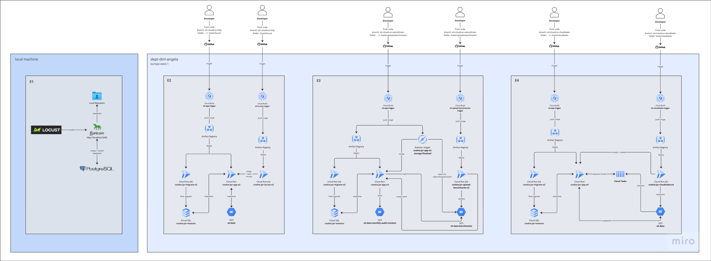

# Experiments
This document explains how benchmark experiments were set up and executed. It starts with settings shared across all experiments, then covers cloud specific setup, and finally details each individual experiment. Image below shows each experiment's architecture on GCP and locally.



## Cross-Experiment Methodology
### Fixed variables 
To keep comparisons fair, the core runtime controls are kept fixed:
- application concurrency baseline: `8` 
- SQLAlchemy pool: `pool_size=8`, `max_overflow=0`
- burst request shape: `80` file-processing requests per run (one file per request)

Rationale:
- `workers=1` and `threads=8` were selected empirically for E1 and then held fixed as the baseline for all experiments (E2-E4).
- This gives bounded parallelism while still producing measurable queue/wait behavior under an 80-request burst.
- Higher thread counts are valid for DB-heavy workloads, but they can amplify lock-contention noise. This behavior was already observed at 8 threads in E1 and mitigated with exponential-backoff retries in the DAO layer
- These controls are fixed so that KPI differences are attributable to workload shape and deployment model, not to changing concurrency settings.

### Common Run Flow
Each run follows the same high-level sequence:
1. Empty database: `POST /db/empty`
2. Reseed database to a fixed baseline: `POST /db/populate/cmp` and `POST /db/populate/trackers`
3. Stage benchmark inputs for the selected test case.
4. Execute the experiment load model.
5. Collect raw and aggregated KPI outputs.


### Repeats
Each experiment x test-case combination was repeated `3` times to reduce single-run noise, increase confidence in observed KPI trends, and enable reporting of mean/min/max behavior for each combination.


### Cloud Baseline (Applies to E2-E4)

E2, E3, and E4 use the same cloud resource baseline so performance differences are primarily driven by delivery model (HTTP push vs event-driven vs task-queued), not by changing infrastructure size between experiments. The baseline is: 
- Cloud Run app service `cpu=2`, `memory=4Gi`, `min instances=4`, `max instances=10`, `container concurrency=8`; 
- Cloud SQL (Enterprise Plus) `8 vCPU`, `64 GB RAM`, `100 GB SSD`;

This baseline was selected after tuning for stability under bursty load and larger-file cases. Lower CPU/memory combinations produced instability, and `min instances=0` repeatedly exposed cold-start admission failures at burst start. Setting `min instances=4` maintained a warm floor and improved repeatability across runs.

The `max instances=10` setting is a theoretical burst-fit for this study design: each run sends 80 requests, and each instance can admit 8 concurrent requests, so `80 / 8 = 10` instances is the smallest full-capacity ceiling that can absorb the burst without adding unnecessary headroom. At the same time, additional instance-level parallelism shifted bottlenecks to the database layer and increased contention.

For operational fairness, before each new repeat or test case in E2-E4, execution **waited for Cloud Run instance count to cool down** to the warm baseline (`4`) again. 

E2-E4 also include a dedicated Cloud Run **migration job** that executes `flask db upgrade` against Cloud SQL before benchmark execution, so all cloud experiments start from a consistent schema state.

Disclaimer: Cloud SQL is an expensive service and was run under a free-trial. As a result, the Cloud SQL configuration parameters were defined by the trial environment.

## E1: Local Execution (branch: e1-local)

E1 runs the app locally and applies burst load to `POST /scan/ingest` with one file per request. Each run sends 80 total requests with 80 Locust users and spawn rate 80, so 80 requests are issued in about 1 second.

E1 uses local filesystem data.
- Seed data is read from `data/seed/`.
- Benchmark inputs and manifests are read from `data/benchmarks/T*`.
- Runtime lifecycle folders are under `data/monthly_tracker_audits/` (`input/<month>`, `processed/<month>`, `failed/<month>`).
- Results are written per test case under `data/benchmarks/<case_folder>/locust_results/`.

Locust execution is coordinated by `/tools/locust/run_locust_benchmarks.py`, which resets and reseeds the database, clears runtime folders, stages files for the selected test case, launches Locust, and aggregates KPI outputs. Single request behavior is defined in `/tools/locust/locustfile.py`, where users consume staged file paths from a shared queue and submit one ingest request per file.

E1 artifacts are written at two levels. 
Per run, raw per-request records are written to `data/benchmarks/<case_folder>/locust_results/raw/<run_id>.json`, and an aggregated run row is appended to `data/benchmarks/<case_folder>/locust_results/aggregated/runs.csv`. 
After repeats complete, per-case summaries are written to `data/benchmarks/<case_folder>/locust_results/aggregated/summary.csv`.

#### How to Run E1 Locally
1. Create and activate virtual environment, then install dependencies:
```bash
python3 -m venv .venv
source .venv/bin/activate
pip install -r requirements.txt
```

2. Start the app locally:
```bash
gunicorn -c gunicorn.conf.py run:app
```

3. Run one test case (example `T1`) with x repeats (example 3):
```bash
python3 tools/locust/run_locust_benchmarks.py --test-cases T1 --repeats 3
```

## E2: Cloud Run HTTP (branch: e2-cloudrun-http)
### GCP resources:
- *Cloud Build triggers:* e2-app-trigger, e2-locust-trigger
- *Cloud Run service:* cookie-jar-app-e2
- *Cloud Run jobs:* cookie-jar-migrate-e2, cookie-jar-locust-e2
- *Cloud SQL instance:* cookie-jar-masters
- *Secret Manager secret:* cookie-jar-masters-db-password
- *GCS bucket:* e2-data

E2 uses the same core workload idea as E1, but deployed on cloud infrastructure. The request model is still synchronous HTTP with one file per `/scan/ingest` request, and Locust still issues an 80-request burst.

The key deployment differences from E1 are infrastructure placement and storage. The app is deployed as a Cloud Run service, benchmark/runtime/result files are stored in GCS instead of local filesystem, and Locust runs as a separate Cloud Run job so load generation does not compete with the app runtime process space. CI/CD(GitHub + Cloud Build) is split into two pipelines: changes under `tools/locust/` redeploy the Locust job, while changes outside `tools/locust/` redeploy the main app service.

E2 preserves the same logical structure used in E1, but in GCS object storage:
- benchmark inputs: `gs://e2-data/benchmarks/<case_folder>/...`
- runtime lifecycle folders: `gs://e2-data/monthly_tracker_audits/input|processed|failed/<month>/...`
- per-case results: `gs://e2-data/benchmarks/<case_folder>/locust_results/...`
- The database seed source remains in the app image (`data/seed/`).

#### How to Run E2 on GCP
```bash
gcloud run jobs execute cookie-jar-locust-e2 \
  --region=europe-west1 \
  --wait \
  --args="^|^tools/locust/run_locust_benchmarks.py|--host=https://cookie-jar-app-e2-656924888958.europe-west1.run.app|--test-cases=T1|--repeats=3"
```

## E3: Cloud Run Event-Driven (branch: e3-cloudrun-eventdriven)
### GCP resources:
- *Cloud Build triggers:* e3-app-trigger, e3-upload-benchmarks-trigger
- *Cloud Run service:* cookie-jar-app-e3
- *Cloud Run jobs:* cookie-jar-migrate-e2, cookie-jar-upload-benchmarks-e3
- *Cloud SQL instance:* cookie-jar-masters
- *Secret Manager secret:* cookie-jar-masters-db-password
- *Eventarc trigger:* cookie-jar-app-e3-storage-finalized
- *GCS bucket:* e3-data-benchmarks, e3-data-monthly-audit-trackers

E3 changes the delivery path from direct HTTP load to storage events. There is no Locust job in this experiment. Instead, a dedicated uploader job (`tools/upload-benchmarks/run_upload_benchmarks.py`) stages benchmark files from the E2 source bucket (`gs://e2-data/benchmarks/<case_folder>/input...`) into the E3 trigger bucket (`gs://e3-data-benchmarks/<case_folder>/input/...`). Each uploaded object generates an Eventarc finalize event, which invokes the Cloud Run app for per-file processing.

E3 intentionally separates bucket roles to prevent recursive triggering. Trigger inputs live in `gs://e3-data-benchmarks/<case_folder>/input/...`, while runtime outputs and experiment artifacts are written to `gs://e3-data-monthly-audit-trackers/` (processed, failed, and results paths). If processed/failed/results were written back into the same Eventarc-watched trigger path, those writes would emit new finalize events and re-invoke the service again, creating a feedback loop. Keeping source and runtime/result buckets separate prevents that recursion.


#### How to Run E3 on GCP
```bash
gcloud run jobs execute cookie-jar-upload-benchmarks-e3 \
  --region=europe-west1 \
  --wait \
  --args="^|^tools/upload-benchmarks/run_upload_benchmarks.py|--host=https://cookie-jar-app-e3-7ncplradoa-ew.a.run.app|--test-case=T1"
```

## E4: Cloud Run + Cloud Tasks (branch: e4-cloudrun-cloudtasks)
### GCP resources:
- *Cloud Build triggers:* e4-app-trigger, e4-cloudtasks-trigger
- *Cloud Run service:* cookie-jar-app-e4
- *Cloud Run jobs:* cookie-jar-migrate-e2, cookie-jar-cloudtasks-e4
- *Cloud SQL instance:* cookie-jar-masters
- *Secret Manager secret:* cookie-jar-masters-db-password
- *Cloud Tasts queue:* cookie-jar-e4-queue
- *GCS bucket:* e4-data

E4 keeps the same per-file ingestion contract, but changes the delivery model from direct HTTP load to queue-driven dispatch. A dedicated runner job (`tools/cloudtasks/run_cloudtasks_benchmarks.py`) stages benchmark files to runtime input, enqueues one Cloud Task per file, and lets Cloud Tasks call `/scan/ingest`.

For increased clarity, E4 uses a dedicated storage bucket:
- benchmark inputs + manifests: `gs://e4-data/benchmarks/<case_folder>/...`
- runtime lifecycle folders: `gs://e4-data/monthly_tracker_audits/input|processed|failed/<month>/...`
- per-case results: `gs://e4-data/benchmarks/<case_folder>/cloudtasks_results/...`

#### How to Run E4 on GCP
```bash
gcloud run jobs execute cookie-jar-cloudtasks-e4 \
  --region=europe-west1 \
  --wait \
  --args="^|^tools/cloudtasks/run_cloudtasks_benchmarks.py|--host=https://cookie-jar-app-e4-656924888958.europe-west1.run.app|--test-cases=T1|--repeats=3"
```

