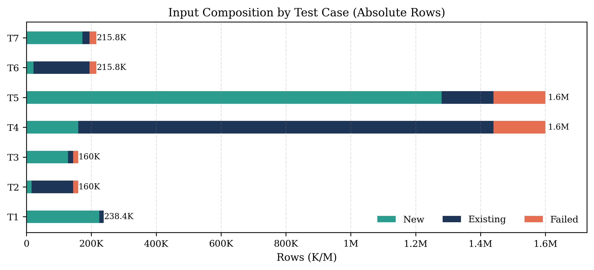

# Test Cases
This document defines benchmark test cases and explains how synthetic workloads were generated.  

The benchmark suite contains one real-world baseline case (`T1`) and six synthetic derived cases (`T2`-`T7`).  
Synthetic cases vary workload size, workload composition, and skew shape.


## Test Case Definitions

### T1: `T1_original`
Real-world baseline input files (`80` files). This case is treated as source data and is not regenerated by the synthetic workload script. 

Data distribution: real-world distribution

### T2: `T2_medium_existing_heavy`
`80` files, `2,000` rows per file (`160,000` rows total). 

Data distribution: `new`: `10%`, `existing`: `80%`, `failed`: `10%`.

### T3: `T3_medium_new_heavy`
`80` files, `2,000` rows per file (`160,000` rows total).

Data distribution: `new`: `80%`, `existing`: `10%`, `failed`: `10%`.

### T4: `T4_large_existing_heavy`
`80` files, `20,000` rows per file (`1,600,000` rows total).

Data distribution: `new`: `10%`, `existing`: `80%`, `failed`: `10%`.

### T5: `T5_large_new_heavy`
`80` files, `20,000` rows per file (`1,600,000` rows total).

Data distribution: `new`: `80%`, `existing`: `10%`, `failed`: `10%`.

### T6: `T6_skewed_existing_heavy`
`80` files total: `79` files x `200` rows + `1` file x `200,000` rows (`215,800` rows total).

Data distribution: `new`: `10%`, `existing`: `80%`, `failed`: `10%`.

### T7: `T7_skewed_new_heavy`
`80` files total: `79` files x `200` rows + `1` file x `200,000` rows (`215,800` rows total).

Data distribution: `new`: `80%`, `existing`: `10%`, `failed`: `10%`.



## Generation Source and Outputs
Synthetic cases are generated by:

```bash
python3 scripts/generate_benchmark_workloads.py
```

The script regenerates `T2`-`T7` and writes:
- `input/` CSV files for each case
- `manifest/manifest.json` per case
    - Each synthetic test case has a manifest/manifest.json file that lists exactly which generated CSV files belong to that case, plus expected row-category counts from generation time.
    - The benchmark runner reads this manifest to decide which files to stage and process for that test case.

`T1` remains the baseline source and is not rewritten.

## Generation Logic
Each generated row is assigned to one of three categories:

### Existing rows
Existing tracker keys are drawn from seed data (`data/seed`), filtered to valid values under ingestion validator rules. These rows are intended to hit existing tracker identity keys in the database, available after reseeding.
- Medium vs Large/Skewed Behavior
    - Generation rules differ by scale to keep datasets practical and still meaningful. The current valid existing-key seed pool contains **6,966 unique tracker keys** after validation filtering.

    - In medium files (2,000 rows), an existing-heavy target implies about 1,600 existing rows per file, which fits comfortably within the ~7k pool and allows strong per-file uniqueness. In large files (20,000 rows), an existing-heavy target implies about 16,000 existing rows per file, which exceeds the ~7k unique pool, so repeated existing keys become unavoidable. The same pressure is even stronger in skewed workloads, where the straggler file has 200,000 rows (about 160,000 existing rows in existing-heavy targets), making repetition inevitable.
    - Because of this, medium cases emphasize unique existing-key assignment within each file when feasible, while large and skewed cases intentionally allow higher repetition pressure for existing rows.

### New rows
New rows are rewritten with synthetic tracker identifiers (for example `bench_new_*`) to force insert-heavy behavior.

### Failed rows
Failed rows are rewritten with a known validation failure marker pattern defined in the `ValidationService` (for example `_ga_failed_lookup_marker_*`), so they are consistently routed to failed processing paths.
